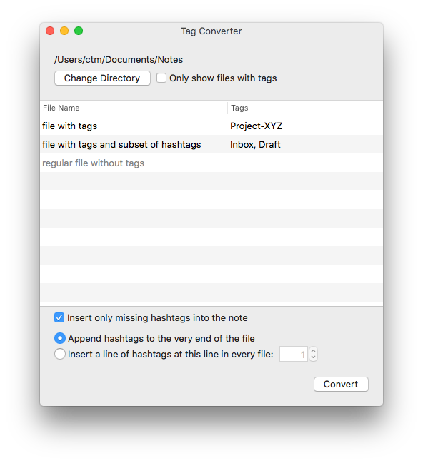

# Tag Converter

Convert Finder/Spotlight metadata tags to `#hashtags`, putting them inside the files.

This tool will take a directory of files, scan for Finder tags, and then allow you to add the tags into the body of the files. The Finder tag "Inbox" will be added as `#inbox` if it is not present in the string contents of the file already.

Can be used to make tags from DEVONthink or nvALT work with [_The Archive_](https://zettelkasten.de/the-archive/) and similar plain-text editors, like Sublime Text 3.

- **Warning:** Will perform changes in-place. Keep a backup of the original if in doubt!
- Requires macOS 10.11 or later.
- [Download latest release](https://github.com/Zettelkasten-Method/macOS-Tag-Converter/releases/latest)

## License

Copyright &copy; 2018 Christian Tietze. Distributed under the MIT License.

See the [LICENSE](/LICENSE) file for details.
